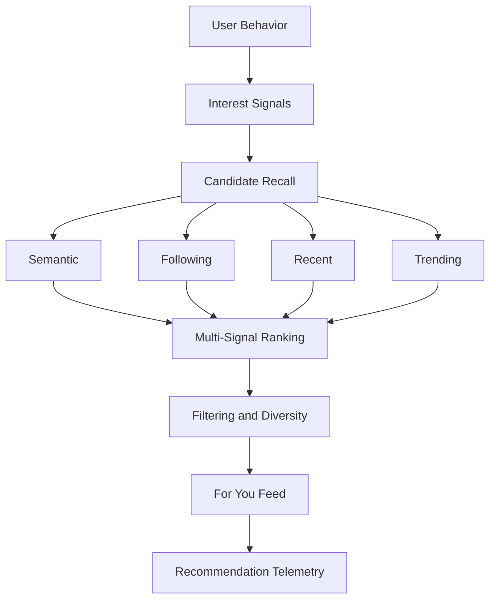
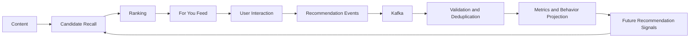

# NexusFeed 个性化内容推荐平台

> Personalized Content Recommendation Platform

NexusFeed 是一个面向内容场景的全栈个性化推荐平台，采用 Go + Vue 构建，围绕内容发布、用户行为采集、个性化召回与排序、推荐效果追踪以及异步事件处理，构建完整的 Feed 推荐链路。

平台同时提供用户认证、统一 Post（短帖、回复、引用和长文）内容、点赞、Following Feed、用户关系、文件存储和汇率查询等业务能力，并通过 PostgreSQL、Redis、Kafka、MinIO、Prometheus 和 Grafana 构成本地开发与可观测基础设施。

当前推荐实现以行为信号、Post embedding 和可配置的确定性规则为基础，核心组合为：

```text
multi-source recall + multi-signal ranking + embedding-based semantic personalization
```

## 核心能力

### 个性化推荐

- **For You Feed**：面向当前用户生成个性化 Post 推荐结果。
- **Multi-source recall**：从 Recent Semantic、Evergreen Semantic、Following、Recent、Trending 五类来源召回候选，并进行合并与去重。
- **正负兴趣信号**：分别构建用户正向兴趣向量与负向兴趣向量；点赞、回复、点击和阅读结果等行为可参与兴趣建模。
- **Embedding 语义个性化**：使用用户兴趣向量与 Post embedding 的 similarity 计算语义相关性，支持正向与负向语义信号。
- **Multi-signal ranking**：综合 semantic similarity、interaction affinity、follow bonus、freshness、time-decayed trending 等信号，并使用确定性的 Post ID 作为最终 tie-breaker。
- **过滤与历史控制**：过滤自身文章、已交互内容、负向兴趣内容和不符合公开范围的内容，并结合已推荐历史进行 fresh/soft-served 控制。
- **多样性选择**：通过作者窗口、作者多样性、网络内外平衡和 embedding 内容相似度惩罚，降低推荐结果重复。
- **推荐元数据与追踪**：每次推荐请求生成 request metadata；结果可持久化 `RecommendationResultTrace`，推荐卡片可携带绑定请求、Post、位置和 ranker 上下文的 tracking token。

推荐链路的详细实现契约见 [Recommendation Feed V3](Go.exchange/docs/recommendation-feed-v3.md)。

## 推荐系统架构



一次 For You 请求会加载用户已有的行为与反馈信号，生成兴趣 profile，召回并合并候选 Post，再通过多信号排序和多样性选择生成结果。

## 推荐反馈闭环



推荐事件通过 Kafka 异步传递给 consumer；consumer 负责事件校验、去重、行为 projection 和指标聚合。click、read_end、not_interested 等可形成后续请求使用的行为事实；feed_dwell 当前主要是原始 telemetry 与 Feed 指标数据，不会立即改变当前请求的排序。

## 推荐行为与 Telemetry

推荐接口和前端 tracking 支持以下行为类型：impression、click、read_end、feed_dwell、not_interested。

推荐请求会生成 UUID request ID；signed tracking token 将用户、文章、请求、位置、策略/ranker、token 生命周期以及阅读策略上下文绑定在一起。客户端提交交互事件后，服务端校验 token 与事件字段，再将有效事件作为 Kafka envelope 异步发布。

Telemetry consumer 会校验单条行为、通过 ConsumerInbox 去重，并批量更新推荐指标和紧凑的 PostBehavior projection。协议与阅读/Feed dwell 测量边界见 [Recommendation Telemetry V2](Go.exchange/docs/recommendation-telemetry-v2.md)。

## 内容与用户系统

NexusFeed 仍是完整的 full-stack content application，而不是只展示算法的 Demo：

- 用户注册、登录、JWT Token 鉴权和 Refresh Token 刷新
- 创建 Post、Post 列表、Post 详情和删除 Post
- 回复的创建、查询和删除
- 长文封面与用户头像上传
- 点赞、取消点赞和批量查询 Post 点赞状态
- Following Feed 与用户 Post 列表
- 用户资料、用户搜索、关注/取消关注、followers 和 following 列表

### 高并发互动处理

点赞链路采用缓存、异步持久化和数据库投影：

```text
Client
  ↓
Redis
  ↓
Worker
  ↓
PostgreSQL
```

- Redis 承担高频点赞状态与请求处理
- Worker 异步将结果持久化到 PostgreSQL
- Lua 脚本保证相关 Redis 操作的原子性
- Worker 支持批量同步和失败重试

## 其他业务能力

项目同时保留独立的汇率查询模块，作为内容推荐主链路之外的业务能力：

- 汇率查询
- 货币列表查询
- 汇率报价查询
- 汇率数据同步任务

## 技术栈

### Backend

- Go 1.25
- Gin
- GORM
- JWT

### Frontend

- Vue 3
- TypeScript
- Vite
- Element Plus
- Pinia

### Data & Messaging

- PostgreSQL 16 with pgvector
- Redis
- Kafka
- MinIO

### Observability

- Prometheus
- Grafana
- Health/readiness endpoints
- pprof

### Infrastructure

- Docker
- Docker Compose

## 项目结构

```text
exchange-platform/
├── Go.exchange/              # Go + Gin 后端服务
├── Exchangeapp_frontend/     # Vue 3 + TypeScript 前端应用
├── docker-compose.yml        # 全栈开发环境编排
└── README.md
```

NexusFeed 是当前产品名称；仓库 slug 和部分历史目录仍沿用原有命名。Go.exchange/、Exchangeapp_frontend/、模块路径、API path 和配置 key 均保持现状。

### Backend 目录

```text
Go.exchange/
├── cmd/              # 命令入口，包括 migrate 和 JWT key generator
├── config/           # 配置加载与运行时依赖初始化
├── consts/           # Redis keys 和 Lua scripts
├── controllers/      # HTTP handlers
├── core/             # HTTP server 启动与优雅退出
├── eventing/         # Kafka 与异步事件发布/消费
├── global/           # DB、Redis 和 MinIO clients
├── initialize/       # 应用初始化与 migration runner
├── metrics/          # Prometheus metrics middleware 和 handler
├── middlewares/      # JWT auth middleware
├── models/           # GORM models
├── observability/    # Prometheus 与 Grafana provisioning
├── router/           # route registration
├── tasks/            # background workers
├── utils/            # JWT 与通用工具
└── main.go           # API/worker runtime entrypoint
```

### Frontend 目录

```text
Exchangeapp_frontend/
├── src/
│   ├── views/         # 页面
│   ├── components/    # 组件
│   ├── router/        # 前端路由
│   ├── services/      # API services
│   └── store/         # 状态管理
└── package.json
```

## 运行模式

同一个 Go application 可以通过 APP_RUNTIME_ROLE 运行不同角色：

| Role | 说明 |
| --- | --- |
| api | 只运行 HTTP API |
| worker | 只运行后台 worker，包括异步投影和事件处理 |
| 未设置或 all | API 与 worker 在同一进程运行 |

推荐本地 Compose 使用拆分后的 api 与 worker services：

```bash
APP_RUNTIME_ROLE=api
```

数据库 migration 与应用启动分离：cmd/migrate 由 Compose 的 migrate one-shot service 执行，API 和 worker 不在启动时执行 AutoMigrate。kafka-init 同样是用于准备 Kafka topics 的 one-shot service；这两个容器成功退出（Exited (0)）是预期状态，api 和 worker 应保持运行。

## 快速启动

### 环境要求

- Docker
- Docker Compose
- Go 1.25+，仅首次生成本地 JWT key 时需要
- 如果不使用容器运行前端，需要 Node.js/npm

### 启动完整开发环境

首次启动先在 Go.exchange 目录生成未跟踪的本地 JWT key：

```powershell
cd Go.exchange
go run ./cmd/gen-jwt-keys --kid local-dev-v1 --out .secrets/jwt
cd ..
docker compose up -d
```

Docker-only key generation 尚未作为本地流程验证，因此使用 host Go 执行 generator。Go.exchange/.env.example 只是配置参考；从仓库根目录运行 Compose 时不会自动加载它。需要覆盖默认值时，请使用 shell environment、仓库根目录 .env 或显式 --env-file。

默认启动会编排 frontend、api、worker、migration、PostgreSQL、Redis、MinIO、Kafka、Kafka UI、embedding、Prometheus 和 Grafana。若只需要手动执行 migration：

```powershell
docker compose run --rm migrate
```

### 本地前端开发

```powershell
cd Exchangeapp_frontend
npm install
npm run dev
```

## 服务地址

| 服务 | 地址 |
| --- | --- |
| Frontend | http://127.0.0.1:5173 |
| API | http://127.0.0.1:3000 |
| API Health | http://127.0.0.1:3000/healthz |
| API Readiness | http://127.0.0.1:3000/readyz |
| API Metrics | http://127.0.0.1:3000/metrics |
| Prometheus | http://127.0.0.1:9090 |
| Grafana | http://127.0.0.1:3001 |
| MinIO Console | http://127.0.0.1:9001 |
| Kafka UI | http://127.0.0.1:8080 |

API 和 worker 在容器内启动 pprof server；当前 Compose 没有将其作为 API/worker 的 host port 发布。

## API 概览

以下 endpoint 使用当前代码中的 path；品牌名称不会改变 API path。

### 推荐接口

需要认证：

```header
GET  /api/recommendations/posts
POST /api/recommendation-events
POST /api/post-view-events
```

POST /api/recommendation-events 接受 impression、click、read_end、feed_dwell 和 not_interested 事件。GET /api/recommendations/posts 返回 For You 推荐结果，并在 telemetry 配置启用且请求命中 rollout 时附带 tracking metadata。

### 内容与社交接口

需要认证：

```header
POST   /api/posts
GET    /api/posts/:id
DELETE /api/posts/:id
GET    /api/posts/:id/replies
POST   /api/posts (with reply_to_post_id)

POST   /api/posts/like-states
GET    /api/posts/:id/like
PUT    /api/posts/:id/like
DELETE /api/posts/:id/like

POST   /api/uploads/article-cover
POST   /api/uploads/profile-avatar

GET    /api/users/search
GET    /api/users/:id
PATCH  /api/users/:id
GET    /api/users/:id/posts?limit=20&cursor=...
GET    /api/users/:id/follow
PUT    /api/users/:id/follow
DELETE /api/users/:id/follow
GET    /api/users/:id/followers
GET    /api/users/:id/following
GET    /api/feed/following?limit=20&cursor=...
```

Following 和 user-post endpoints 返回 {"items": [], "next_cursor": null} 形状；cursor 是 opaque cursor。

### 认证接口

公开接口：

```header
POST /api/auth/login
POST /api/auth/register
POST /api/auth/refresh
```

### 汇率与文件接口

```header
GET  /api/exchangeRates
GET  /api/exchange/currencies
GET  /api/exchange/quote
GET  /api/files/*objectKey
```

其中 POST /api/exchangeRates 是需要认证的汇率数据写入接口。

## 数据与基础设施

- **PostgreSQL**：持久化用户、文章、社交关系、行为 projection、推荐 request/trace 和指标数据；本地 Compose 使用 PostgreSQL 16，并启用 pgvector 支持 embedding 存储与相似度检索。
- **Redis**：缓存、点赞热路径、异步任务状态和 telemetry 相关限流/去重辅助状态。
- **Kafka**：承载 recommendation telemetry 和文章 embedding 等异步事件；consumer 负责校验、去重、指标聚合与行为 projection。
- **MinIO**：保存文章封面、用户头像等对象，并通过 /api/files/*objectKey 提供文件访问。
- **Prometheus / Grafana**：采集 API、worker、推荐生成、telemetry 和 Kafka consumer 相关指标并提供本地看板。
- **Docker Compose**：在仓库根目录统一编排 Go.exchange、Exchangeapp_frontend、数据库、消息、存储和观测服务。

数据库 schema 变更由 migration job 独立执行，不在 API 或 worker 启动阶段自动修改结构。

## 开发说明

后端和前端仍使用原有目录与模块路径：

```powershell
cd Go.exchange
cd ../Exchangeapp_frontend
npm install
npm run dev
```

推荐系统的详细设计和 telemetry 边界：

- [Go.exchange/docs/recommendation-feed-v3.md](Go.exchange/docs/recommendation-feed-v3.md)
- [Go.exchange/docs/recommendation-telemetry-v2.md](Go.exchange/docs/recommendation-telemetry-v2.md)
