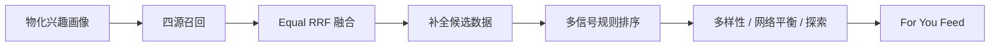
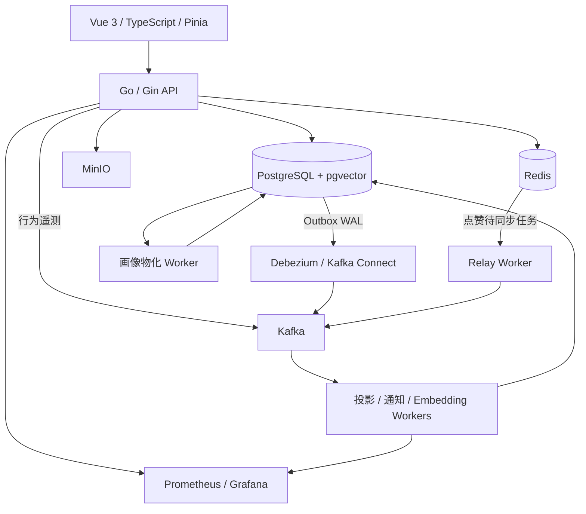

# EX

> 基于 Go + Vue 的个性化内容社区，围绕推荐系统、异步事件处理与数据一致性构建。

EX 将内容发布、社交互动、行为采集和个性化推荐串联成完整的产品流程：用户发布短帖或长文，通过关注、点赞、回复和阅读产生反馈，后台将反馈投影为行为数据和兴趣画像，为后续 Feed 请求提供推荐信号。

项目的工程重点是 **Go 后端的推荐链路与状态一致性**，同时提供 Vue 3 前端、容器化开发环境、自动化测试和可观测能力。

[技术设计](#技术设计) · [系统架构](#系统架构) · [快速启动](#快速启动) · [测试与验证](#测试与验证) · [项目结构](#项目结构)

## 项目概览

| 方向 | 实现内容 |
| --- | --- |
| 个性化推荐 | 四源召回、Equal RRF 候选融合、正负兴趣向量、多信号排序、多样性与探索 |
| 异步一致性 | Redis Lua 原子操作、版本化点赞快照、事务 Outbox、Debezium CDC、Consumer Inbox 去重 |
| 内容与社交 | 统一 Post 模型、短帖与长文、回复与引用、转发、关注、通知、游标分页 |
| 全栈交互 | Feed 与详情页数据衔接、跨页面互动同步、账号身份隔离、阅读行为采集 |
| 工程基础 | API / Worker 分角色运行、独立迁移、健康检查、Prometheus / Grafana、分层 CI |

## 产品功能

- **内容浏览**：For You 推荐流、Following 关注流、个人时间线、帖子详情和回复列表。
- **内容创作**：发布短帖、长文、回复与引用，支持图片上传、转发和删除。
- **用户互动**：注册登录、用户搜索、资料编辑、关注关系、点赞历史、通知与已读状态。
- **语言能力**：按需翻译帖子，使用 Redis 缓存和进程内请求合并减少重复模型调用。
- **扩展业务**：汇率查询、货币列表与报价。

## 技术设计

### 1. 推荐：将候选召回、排序与最终选择分开

Feed 需要同时处理兴趣相关性、内容新鲜度、关注关系和重复推荐。项目将这些职责拆成独立阶段，便于定位结果来源和调整策略。



- **召回**：Semantic、Following、Recent、Trending 四个顶层来源；Semantic 内部分配近期内容与长尾内容配额，并执行补召回。
- **融合**：Equal RRF 按各来源的名次合并候选，去重后截断为有界候选池。融合分数与来源数量用于候选准入，不进入最终排序的 `BaseScore`。
- **排序**：基于正负语义相关性、交互与作者亲和度、关注关系、时间衰减热度等信号计算得分。候选只要具有可比较的 embedding，就参与正向语义打分，不受召回来源限制。
- **选择**：结合作者多样性、内容相似度惩罚、网络内外平衡、探索和已推荐历史控制输出；通过时间与 Post ID 等规则处理同分情况。

这种拆分使“为什么进入候选池”和“为什么排在前面”可以分别分析。当前实现采用 embedding 与可配置规则；推荐效果仍需通过真实行为数据和离线评估衡量。

### 2. 画像：把重建成本移到后台，并处理并发失效

推荐请求按用户主键读取物化画像，后台 Worker 根据行为与 embedding 变化重建画像，减少请求阶段反复扫描历史行为的工作。

- 画像携带配置哈希、画像版本与 embedding 版本，读取时检查兼容性。
- 兼容的过期画像仍可用于请求，同时排队重建；缺失或不兼容时采用冷启动路径。
- Worker 在事务中更新交互状态、正负兴趣向量和作者亲和度。
- 重建完成后，按 `user_id + dirty_version` 删除本次领取的队列记录。如果重建期间又发生新行为，新版本的失效标记会保留，避免更新被旧任务清除。

设计取舍是允许画像短暂滞后，以换取更稳定的请求成本，并通过版本与持久化队列恢复更新。

### 3. 点赞：Redis 热路径与版本化异步落库

点赞涉及用户状态、计数和后续推荐信号。项目将交互热路径放在 Redis，并把计数快照与行为事件异步投影到 PostgreSQL。

```text
点赞 / 取消点赞
  → Redis Lua：原子更新状态、计数与待同步信息
  → Relay：领取任务并发布 Kafka 消息
  → Consumer：去重并更新 PostgreSQL 投影
```

- Lua 脚本将相关 Redis 更新组合为原子操作。
- Relay 使用任务领取、确认与重新入队机制处理发布失败。
- 点赞快照携带版本号，数据库仅接受高于 `like_sync_version` 的快照，防止旧消息覆盖新计数。
- Inbox 去重与数据库投影在同一事务完成；消息处理成功后再提交消费位点。
- 集成测试覆盖 Redis 到 PostgreSQL 的投影、状态过期恢复、删除清理失败后的修复等场景。

这里采用最终一致性：Redis 中的即时状态与数据库投影可能存在同步延迟，恢复机制需要与热路径一起设计。

### 4. 事件：用事务 Outbox、CDC 与 Inbox 衔接业务和消息

关注、回复等操作需要同时改变业务数据并产生通知事件。项目把业务变更和 Outbox 事件写入同一 PostgreSQL 事务，再由 Debezium 读取变更日志并路由到 Kafka。

```text
业务事务：写入业务数据 + Outbox
  → PostgreSQL WAL
  → Debezium / Kafka Connect
  → Kafka
  → Consumer Inbox 去重 + 通知投影事务
```

事务提交决定业务与待发送事件是否一起生效；消费者使用事件 ID 去重，处理重复投递。通知消费者还包含批处理与死信队列处理。这套设计将数据库内的原子性与消息侧的重试、幂等分开落实。

### 5. 反馈与追踪：让推荐结果能对应到用户行为

推荐请求记录 request metadata 与结果 trace；启用 telemetry 且命中 rollout 时，为结果附带签名 tracking token，绑定用户、Post、请求、位置及策略上下文。

前端采集 `impression`、`click`、`read_end`、`feed_dwell` 和 `not_interested` 等事件。服务端校验后经 Kafka 异步消费，在事务中去重并更新指标及行为投影，供后续推荐使用。`feed_dwell` 主要用于原始遥测和 Feed 指标。

### 6. 全栈体验：关注页面切换和异步响应的正确性

- **Feed 到详情**：传递带用户身份与有效期的 Post 快照，支持详情页使用已有内容，并限制过期或跨账号复用。
- **跨页面同步**：通过集中同步入口传播点赞、转发、回复数、关注、删除与作者资料变化。
- **身份边界**：结合账号身份和请求生命周期，处理切换账号、导航及异步返回时的状态更新。
- **翻译缓存**：缓存键包含内容、源语言与目标语言、模型后端身份及提示词版本；进程内 `singleflight` 合并相同请求，缓存 TTL 加入抖动。
- **认证**：Ed25519 JWT 访问令牌，配合 Redis 中的 Refresh Token 轮换与复用检测。

## 系统架构



同一 Go 应用通过 `APP_RUNTIME_ROLE` 拆分为 `api` 与 `worker`；未设置或设为 `all` 时组合运行。数据库迁移由独立任务执行，API 和 Worker 启动时不执行 `AutoMigrate`。

`/healthz` 用于存活检查，`/readyz` 检查数据库、schema 兼容性和 Redis 等就绪条件。API 将 Kafka 异常报告为降级；Worker 另外记录流水线状态、消费提交、失败与积压。指标入口为 `/metrics`。

## 技术栈

| 层次 | 技术 |
| --- | --- |
| 后端 | Go 1.25、Gin、GORM、JWT / Ed25519 |
| 前端 | Vue 3、TypeScript、Vite、Pinia、Vue Router、Element Plus / Vant |
| 数据与存储 | PostgreSQL 16、pgvector、Redis、MinIO |
| 消息与 CDC | Kafka、kafka-go、Debezium、Kafka Connect |
| 运行与观测 | Docker Compose、Prometheus、Grafana、pprof |
| 测试与交付 | Go test / vet、Vitest、Vue Test Utils、GitHub Actions |

## 快速启动

以下命令从仓库根目录执行，面向首次启动的本地开发环境。需要 Docker Compose 和 Go 1.25+；单独开发前端时使用 Node.js 20 与 npm。

### 1. 生成本地 JWT 密钥

```powershell
cd Go.exchange
go run ./cmd/gen-jwt-keys --kid local-dev-v1 --out .secrets/jwt
cd ..
```

### 2. 启动应用与依赖

```powershell
docker compose up -d api worker db redis kafka minio frontend
docker compose ps -a
```

Compose 会按依赖执行 Outbox schema 检查、数据库迁移、Kafka topic 初始化及 CDC 初始化，并启动 Kafka Connect。一次性初始化服务成功退出属于正常状态；API、Worker 和基础服务应持续运行。

配置覆盖使用 shell 环境变量、仓库根目录 `.env` 或 `docker compose --env-file <文件路径>`。`Go.exchange/.env.example` 是参考模板，不会被根目录 Compose 自动加载。复用旧数据库时，应先检查 Outbox schema；旧结构的切换由专用命令与显式确认保护。

Embedding 和翻译默认关闭。启用前需配置相应的 `*_ENABLED`、`*_BASE_URL`、`*_MODEL` 及服务所需的 API Key。以上启动命令不启动声明了 GPU 需求的可选 `embedding` 服务；语义推荐需要可用的 embedding 服务与已生成的内容向量。

### 3. 访问与体验

| 入口 | 地址 |
| --- | --- |
| Web 应用 | http://127.0.0.1:5173 |
| API 存活 / 就绪 | http://127.0.0.1:3000/healthz / http://127.0.0.1:3000/readyz |
| API 指标 | http://127.0.0.1:3000/metrics |
| MinIO Console | http://127.0.0.1:9001 |

注册账号后，可以发布帖子、使用另一账号关注和互动，查看 Following、通知与个人时间线，再体验 For You。初始数据库没有足够内容和行为时，个性化效果需要随数据积累观察。

可选启动观测服务与 Kafka 管理界面：

```powershell
docker compose up -d prometheus grafana kafka-ui
```

对应地址：Prometheus `http://127.0.0.1:9090`、Grafana `http://127.0.0.1:3001`、Kafka UI `http://127.0.0.1:8080`。pprof 在 API / Worker 容器内监听 `6060`，当前未映射到宿主机。

## 单 VPS 生产化预备

生产部署的目标拓扑是：前端继续部署在 Cloudflare Pages，单台 Linux VPS 运行
Caddy、API、Worker、PostgreSQL、Redis、Kafka、Kafka Connect、MinIO 以及一次性
初始化任务。RSSHub 作为可选的 `rss` profile 运行在同一 private network，默认
生产启动不会拉起它。生产 Compose 与本地开发 Compose 分开；根目录的
`docker-compose.yml` 仍然只负责本地开发，生产入口是
`deploy/compose.prod.yml`。本仓库只准备配置、镜像和运维脚本，不在这里执行 VPS
部署、域名配置或证书申请。

### 受保护生产部署

VPS 上先执行只读检查：

```bash
bash scripts/deploy-production.sh CHECK
```

人工确认检查结果后，才执行：

```bash
bash scripts/deploy-production.sh DEPLOY-PRODUCTION
```

如果 `CHECK` 显示 `compose_status=pending`，脚本会在任何合并、构建、备份或
运行时更新前停止。此时需要人工完成以下流程：

1. 审核 `deploy/compose.prod.yml` 的差异。
2. 如果批准，手工将 Git 快进到目标提交，并手工应用所需的基础设施、网络、
   volume、镜像、环境变量或服务变更。
3. 验证生产健康状态。
4. 使用 `CHECK` 输出的完整目标 SHA 记录人工确认：

```bash
bash scripts/deploy-production.sh ACK-COMPOSE-APPLIED <full-target-sha>
```

`ACK-COMPOSE-APPLIED` 只记录操作员已经完成并验证 Compose 应用，不会自动修改
基础设施。ACK 成功后重新执行：

```bash
bash scripts/deploy-production.sh DEPLOY-PRODUCTION
```

脚本通过独立的 runtime 和 Compose 状态文件区分“代码部署完成”与“Compose 已由
操作员应用”。

脚本不部署前端，不运行 RSSHub / DevData，不自动重建有状态基础设施，也不执行
自动回滚；前端仍由 Cloudflare Pages 负责。

### 配置和 JWT

在 VPS 上执行：

```bash
cp deploy/.env.example deploy/.env
```

编辑 `deploy/.env`，至少替换所有 `replace-with-*` 值，并填写真实的
`API_DOMAIN`、Cloudflare Pages 域名对应的 `CORS_ALLOWED_ORIGINS`、数据库/Redis/
MinIO 密钥和 `JWT_*` 参数。不要把 `deploy/.env`、JWT 私钥、X/RSSHub token 或
Workers AI key 放进 Git，也不要通过 `VITE_*` 变量向前端注入服务端密钥。

JWT 私钥与公钥目录由宿主机路径挂载到容器内的
`/run/secrets/jwt/private.pem` 和 `/run/secrets/jwt/public/`，两个服务只读使用。
可以在受信任主机上用已有工具生成一套生产密钥：

```bash
cd Go.exchange
go run ./cmd/gen-jwt-keys --kid prod-v1 --out /srv/exchange-platform/.secrets/jwt
cd ..
```

### 启动顺序和入口

构建并启动生产栈：

```bash
docker compose --env-file deploy/.env -f deploy/compose.prod.yml up -d
```

一次性初始化按以下依赖顺序执行：`outbox-cutover` → `migrate` → `kafka-init` →
`kafka-connect` → `cdc-init` → API / Worker。已有旧 Outbox schema 时，先备份并检查
状态；只有确认要执行受保护的 prelaunch cutover 时，才在 `deploy/.env` 中显式设置
`OUTBOX_CUTOVER_CONFIRM_PRELAUNCH=true`。

前端在 Cloudflare Pages 构建时使用：

```text
VITE_API_BASE_URL=https://api.example.com/api
```

生产 Compose 不包含前端服务，也不向宿主机公开数据库、Redis、Kafka、Kafka
Connect、MinIO 或 API 端口；公网只由 Caddy 暴露 80/443，并将域名流量代理到
内部 `api:3000`。API 的存活/就绪检查分别是：

```bash
curl -fsS https://api.example.com/healthz
curl -fsS https://api.example.com/readyz
```

### DevData 运维

生产镜像中的 DevData 使用编译后的 `/app/go-exchange-devdata`，运行时 registry 是
`Go.exchange/config/sources/x_sources.json`；测试 fixture 仍保留在
`Go.exchange/devdata/testdata/x_sources_v1.json`。`.devdata` 挂载到持久化
`devdata-state` volume。DevData 服务使用 `devdata` profile，不会随默认生产启动
自动抓取 RSSHub；执行前先在 `deploy/.env` 配置 `TWITTER_AUTH_TOKEN`。默认
`RSSHUB_BASE_URL=http://rsshub:1200`，RSSHub 使用 `rss` profile 启动，不公开宿主机
端口。RSSHub 源码继续由独立的 `RSSHub` 仓库维护，主仓库只记录生产 Compose
引用的镜像名和运行参数。

首次完整刷新：

```bash
docker compose --env-file deploy/.env -f deploy/compose.prod.yml \
  --profile rss --profile devdata run --rm devdata \
  refresh --source=rsshub --allow-destructive --reset-checkpoint
```

日常增量和校准：

```bash
docker compose --env-file deploy/.env -f deploy/compose.prod.yml \
  --profile rss --profile devdata run --rm devdata \
  refresh-incremental --source=rsshub --shard=auto
docker compose --env-file deploy/.env -f deploy/compose.prod.yml \
  --profile rss --profile devdata run --rm devdata \
  refresh --source=rsshub --allow-destructive
docker compose --env-file deploy/.env -f deploy/compose.prod.yml \
  --profile rss --profile devdata run --rm devdata verify
```

### 备份和受保护重建

PostgreSQL 备份写入被 `.gitignore` 忽略的 `backups/postgres/`：

```bash
bash scripts/backup-postgres.sh
```

恢复前先停止写入流量，并将备份导入 `db` 容器；下面示例会清空目标库中的现有
对象，必须确认目标就是生产数据库：

```bash
docker compose --env-file deploy/.env -f deploy/compose.prod.yml exec -T db \
  sh -c 'PGPASSWORD="$POSTGRES_PASSWORD" pg_restore --clean --if-exists --no-owner --no-privileges -U "$POSTGRES_USER" -d "$POSTGRES_DB"' \
  < backups/postgres/goexchange_YYYYMMDDTHHMMSSZ.dump
```

如果需要重建派生 DevData 状态，脚本要求显式确认：

```bash
bash scripts/rebuild-production-data.sh RESET-PRODUCTION
```

该脚本只清理 `.devdata` 快照/checkpoint，并通过现有 guarded refresh 对 DevData
镜像做 destructive reconciliation；不会自动删除 PostgreSQL、Redis、Kafka 或
MinIO volume，也不会删除用户上传对象。执行前仍应先做 PostgreSQL 备份，并确认
当前 RSSHub/X source 配置和速率限制允许重新拉取。

### 当前明确不包含

VPS 防火墙、DNS、Cloudflare Pages 项目设置、真实 JWT/第三方 token、RSSHub
镜像发布、自动 CD、定时任务编排、对象存储生命周期和异地备份仍由
部署者单独决定。生产 Compose 的可观测服务使用 `observability` profile：

```bash
docker compose --env-file deploy/.env -f deploy/compose.prod.yml \
  --profile observability up -d prometheus grafana
```

## 测试与验证

后端基础检查：

```powershell
cd Go.exchange
go test ./... -count=1
go vet ./...
```

前端测试与构建，在仓库根目录另开终端执行：

```powershell
cd Exchangeapp_frontend
npm ci
npm test
npm run build
```

Windows PowerShell 如遇 npm 脚本执行策略限制，可使用 `npm.cmd`。

| 验证层级 | 已有验证入口 |
| --- | --- |
| 后端单元与静态检查 | 推荐融合与排序、签名追踪、认证、翻译等测试，以及 `go vet` |
| PostgreSQL / Redis 集成 | 点赞投影、Post 删除身份一致性、回复缓存失效、画像重建与队列竞争 |
| Kafka 初始化 | Topic 创建的幂等性、必需 topic 与分区数检查 |
| 前端 | 组件与状态管理测试、身份切换、互动同步、遥测、类型检查及生产构建 |
| 容器 | 后端生产镜像与前端镜像构建 |
| 真实 CDC | 独立的 PostgreSQL / Kafka / Debezium 验收测试 |

CI 工作流 将后端基础检查、PostgreSQL / Redis 集成、Kafka 初始化、前端测试构建和容器构建拆成独立任务；集成任务还检查关键用例的实际 `PASS` 标记，避免因缺少依赖而跳过测试。

本地 PostgreSQL / Redis 集成测试需配置 `POSTGRES_TEST_DSN`、`REDIS_TEST_ADDR` 等测试连接，使用独立测试数据库。真实 CDC 验收另需 `RUN_CDC_INTEGRATION=1`、Kafka 与 Connect 配置。缺少相应依赖时，集成测试会跳过；验证结果以实际运行日志为准。

## 项目结构

```text
./
├── Go.exchange/
│   ├── auth/              # 访问令牌与刷新会话
│   ├── cdc/               # Debezium connector 初始化与验收
│   ├── cmd/               # 迁移、密钥生成、Kafka / CDC 初始化
│   ├── controllers/       # HTTP 接口与推荐 serving
│   ├── eventing/          # 事件协议、Kafka、Outbox / Inbox
│   ├── likes/             # Redis 点赞状态与 Lua 原子操作
│   ├── models/            # 业务模型、行为与推荐画像
│   ├── tasks/             # 异步消费、投影与画像物化
│   ├── translation/       # 翻译调用、缓存与请求合并
│   ├── runtimehealth/     # API / Worker 就绪状态
│   └── observability/     # Prometheus / Grafana 配置
├── Exchangeapp_frontend/
│   └── src/
│       ├── components/    # 内容、用户与通用交互组件
│       ├── views/         # Feed、详情、个人页与通知等页面
│       ├── services/      # API 调用、阅读与推荐遥测
│       └── store/         # 会话、Feed、身份与跨页面状态
├── .github/workflows/     # 持续集成
├── deploy/                # VPS 生产 Compose、Caddy 与环境模板
├── scripts/               # 备份和受保护重建脚本
├── docker-compose.yml     # 全栈开发环境
└── README.md
```
